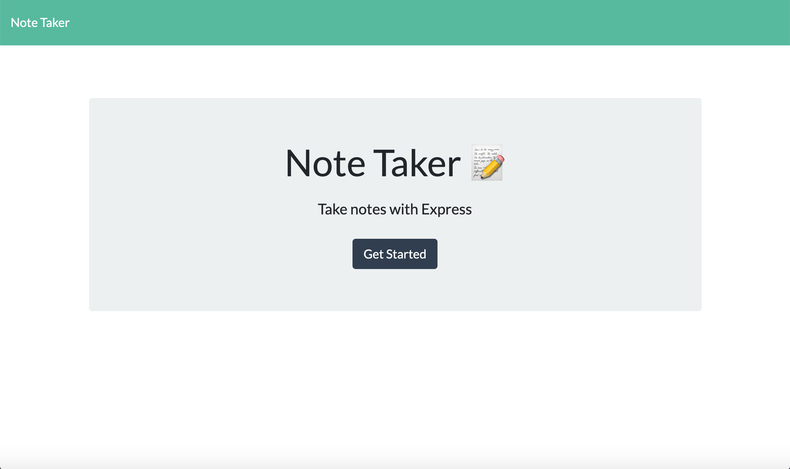
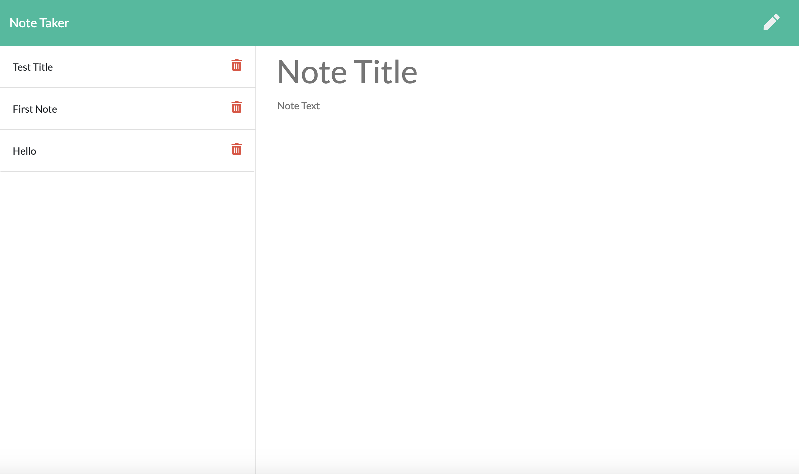

# 11-NoteTaker

## Description

* This application allows users to create, save, and delete notes.  Unfortunatly, I was not able to get the delete feature to work.

* To run the application, start up the server by typing "node server.js" in terminal and type "localhost:8080" in browser.

## Link to Repository

* https://github.com/alp13097/11-NoteTaker

## Screenshots

